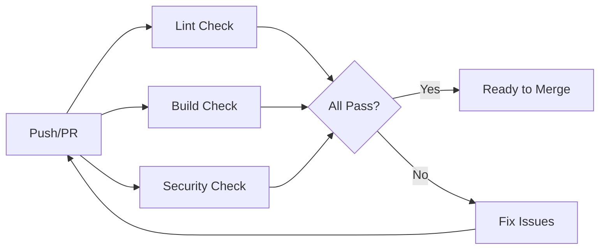

# GitHub Configuration

This directory contains GitHub-specific configuration files for the CDN-OrPaynter-AI repository.

## Contents

### 📁 `workflows/`

Contains GitHub Actions workflow files for Continuous Integration (CI) and automation.

- **`ci.yml`** - Main CI workflow that runs on pull requests and pushes to main
  - Code formatting checks with Prettier
  - Build verification for Next.js application
  - Security audit for npm dependencies

### 📁 `rulesets/`

Contains branch ruleset configuration files (for reference/documentation).

- **`main-branch-protection.json`** - Configuration for main branch protection ruleset

### 📄 `BRANCH_RULESET.md`

Comprehensive documentation for branch protection rules and rulesets, including:

- Recommended ruleset configuration
- Setup instructions
- Development workflow guidelines
- Benefits and maintenance tips

## Quick Start

### For Repository Administrators

1. **Set up Branch Rulesets:**
   - Follow the instructions in `BRANCH_RULESET.md`
   - Configure via GitHub Settings → Rules → Rulesets
   - Use `rulesets/main-branch-protection.json` as a reference

2. **Verify CI Workflows:**
   - The CI workflow will run automatically on pull requests
   - Ensure all checks pass before merging

### For Contributors

1. **Before Submitting a PR:**
   - Ensure your code passes linting: `npm run lint`
   - Verify the build succeeds: `npm run build`
   - Address any security vulnerabilities: `npm audit`

2. **PR Requirements:**
   - At least 1 approving review required
   - All CI checks must pass (Lint, Build, Security)
   - All conversations must be resolved

## CI/CD Pipeline

## Workflows Overview

### CI Workflow (`ci.yml`)

**Triggers:**

- Pull requests targeting `main`
- Direct pushes to `main`

**Jobs:**

1. **Quality Checks** - Runs Prettier to check code formatting
2. **Build** - Builds the Next.js application
3. **Security Audit** - Checks for dependency vulnerabilities

**Node.js Version:** 20 (LTS)

**Required Status Checks:**
All three jobs must pass for a PR to be merged.

## Best Practices

- Always create feature branches from `main`
- Keep PRs small and focused
- Write descriptive commit messages
- Respond to review comments promptly
- Ensure CI checks pass before requesting review
- Squash commits when merging to maintain clean history

## Maintenance

### Updating Workflows

When modifying workflow files:

1. Test changes in a feature branch first
2. Verify the workflow runs successfully
3. Update this README if adding new workflows

### Updating Rulesets

When modifying branch protection rules:

1. Update `BRANCH_RULESET.md` documentation
2. Update `rulesets/main-branch-protection.json` reference
3. Apply changes via GitHub UI Settings

## Resources

- [GitHub Actions Documentation](https://docs.github.com/en/actions)
- [GitHub Branch Rulesets](https://docs.github.com/en/repositories/configuring-branches-and-merges-in-your-repository/managing-rulesets/about-rulesets)
- [Next.js Documentation](https://nextjs.org/docs)
- [Netlify Documentation](https://docs.netlify.com/)
